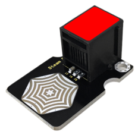
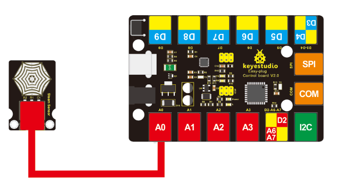

# KS0246 keyestudio EASY plug Steam Sensor



## 1. Introduction

Keyestudio steam sensor is an analog sensor and can make a simple rainwater detector and liquid level switch. When humidity on the surface of the sensor goes up, the output voltage will increase.

Warning: The connector is not waterproof, please be careful not to put the connector directly in water.

The module can be connected to the analog input interface with only one line, which is very easy and convenient. 

**Special Note:**
The sensor/module is equipped with the RJ11 6P6C interface, compatible with our keyestudio EASY plug Control Board with RJ11 6P6C interface.

If you have the control board of other brands, it is also equipped with the RJ11 6P6C interface but has different internal line sequence, can’t be used compatibly with our sensor/module.

## 2. Features

- Connector: Easy plug
- Working Voltage: 5V
- Working Current: <20mA
- Working Temperature: －10℃～＋70℃
- Interface Type: Analog Signal Output

## 3. Technical Details

- Dimensions: 35mm * 24mm * 18mm
- Weight: 4.6g

## 4. Connect It Up

Connect the EASY Plug steam sensor to control board using an RJ11 cable. Then connect the control board to your PC with a USB cable.



## 5. Upload the Code

Download code:  [Code](./Code.7z)

```c
void setup()
{
	Serial.begin(9600); //open serial port, and set baud rate at 9600bps
}

void loop()
{
    int val;
    val=analogRead(0); //plug vapor sensor into analog port 0
    Serial.print("Moisture is ");
    Serial.println(val,DEC); //read analog value printed on serial port 
    delay(100);
}
```

## 6. Result

When detect the different degree of humidity, the sensor outputs different value. If the sensor’s sensing area detects a water drop, the analog value will be displayed on monitor window.

